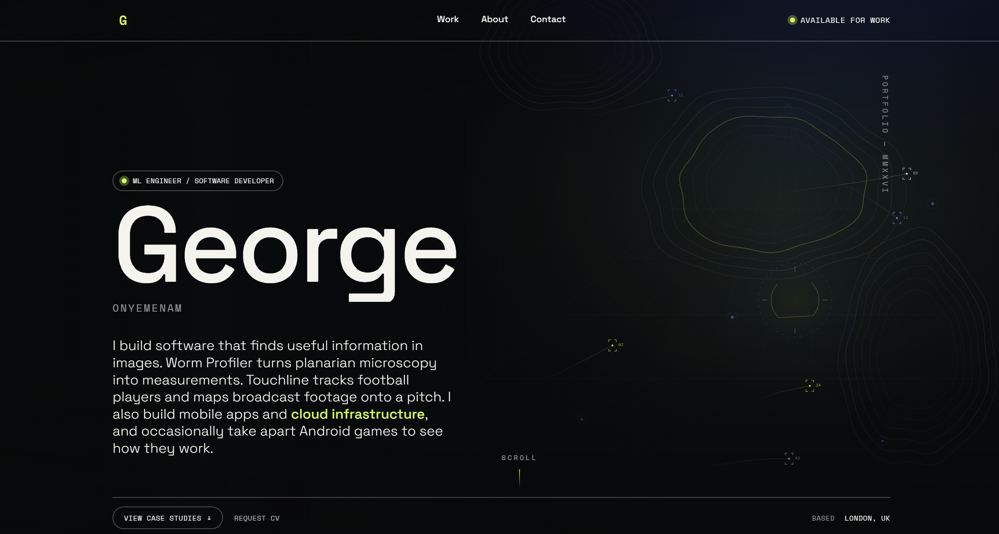
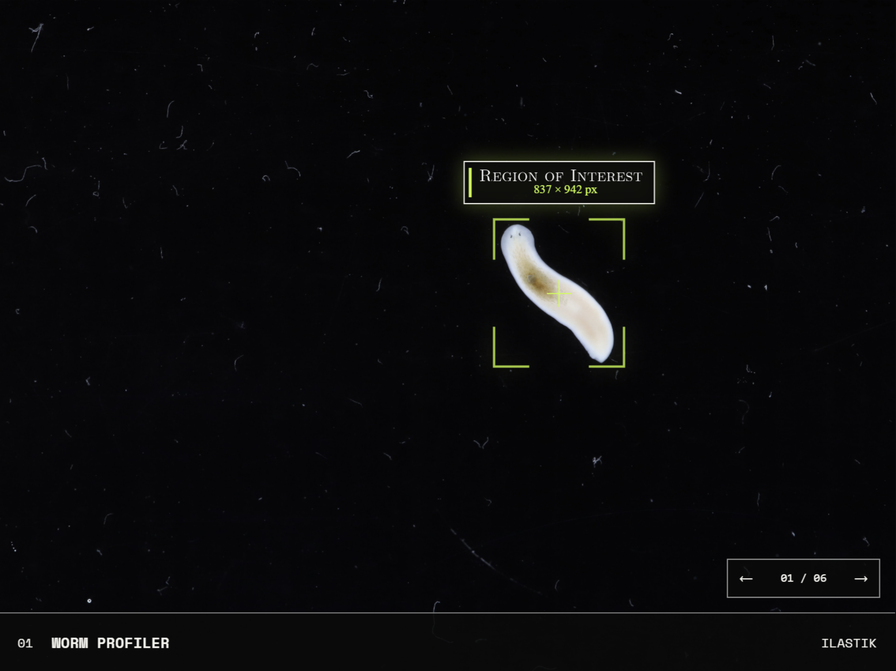
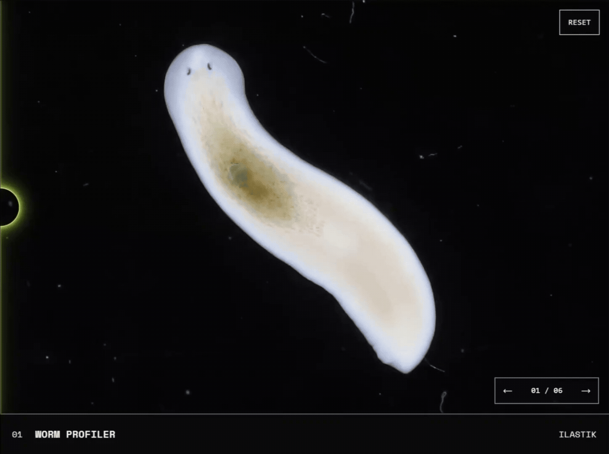
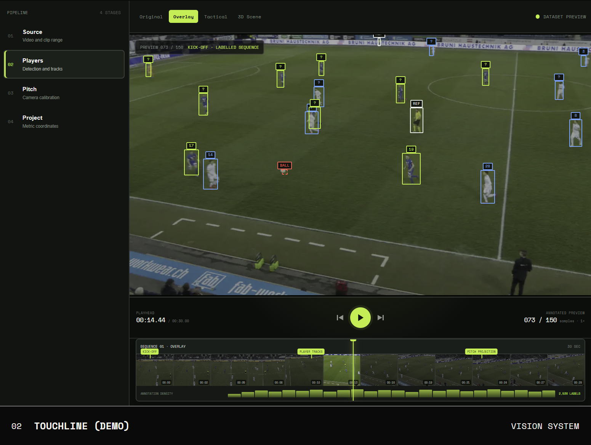

# George Onyemenam — Portfolio

The source for [onyemenam.dev](https://onyemenam.dev), my interactive portfolio as an ML engineer and software developer.

The site presents two ongoing areas of work: scientific-imaging software for planarian research and a football-vision system for player tracking and pitch reconstruction. The portfolio itself is also an engineering project, with responsive interactive demos, stylus-aware controls, progressive asset loading, WebGL rendering and a lightweight Cloudflare deployment.




## Live site

**[onyemenam.dev](https://onyemenam.dev)**

## Selected work

### Worm Profiler

Worm Profiler is an end-to-end imaging pipeline for cross-strain *Schmidtea polychroa* transplantation experiments. It prepares 26 MP camera captures for efficient processing in Ilastik, separates donor tissue, host tissue, eyes and background, validates donor masks against hand-drawn ground truth, and turns longitudinal images into reproducible morphometric measurements.

The embedded case-study interface includes:

- Responsive source/segmentation comparison across mouse, touch and stylus input.
- High-resolution crops for detailed inspection without loading every original capture into the page.
- A WebGL2 magnifying lens with a non-WebGL fallback.
- Frame-to-frame navigation that preserves the active comparison state.
- Segmentation-class context, project outputs and experimental limitations.





### Touchline (demo)

Touchline explores a football-vision workflow across detection, player tracking, camera homography and pitch projection. The retained browser demo uses a labelled 30-second SoccerNet sequence and keeps each displayed observation tied to its source frame.

The SoccerNet-derived frame sequence used by the live demonstration is retained locally and is not distributed through this repository. The interface and implementation remain available for technical review, but a fresh checkout cannot reproduce the footage-backed demo without separately authorized media.

The embedded demo includes:

- Frame-accurate timeline scrubbing and stepped navigation.
- Player and ball annotations rendered over the source footage.
- Responsive scaling that preserves alignment between footage and overlays.
- Bounded frame preloading and cache pruning for smoother playback.
- A compact mobile layout that retains the desktop interaction model.


## Portfolio engineering

Beyond the case studies, the site includes:

- A custom project index with keyboard, pointer and stylus interactions.
- A Three.js viewer for the queued-project 3D model.
- Responsive layouts for desktop, tablet and narrow mobile screens.
- A service worker and deliberate asset caching strategy.
- Reduced-motion and accessibility-aware interaction states.
- Static asset delivery through a Cloudflare Worker/Vite build.

## Technology

- Semantic HTML
- Modern CSS
- Vanilla JavaScript modules
- WebGL2 and GLSL
- Three.js
- Vite
- Cloudflare Workers and Wrangler
- OpenAI Sites deployment tooling
- Sharp-based image preparation utilities

## Project structure

```text
.
├── index.html                 # Page structure and project presentation
├── styles.css                # Responsive layout, visual system and motion
├── script.js                 # Portfolio interactions and embedded demos
├── worm-lens-webgl.js        # WebGL2 comparison-lens renderer
├── worker/                    # Cloudflare Worker entry point
├── public/
│   ├── assets/brand/          # Site and social marks
│   ├── assets/demos/          # Browser-ready demo media
│   └── streamline-sw.js       # Asset caching/service worker
└── tools/                     # Image and lens asset-generation utilities
```

More implementation detail is available in [docs/ARCHITECTURE.md](docs/ARCHITECTURE.md).

## Running locally

### Requirements

- Node.js **22.13 or newer**
- npm

### Setup

```bash
git clone https://github.com/cloutician/portfolio
cd portfolio
npm install
npm run dev
```

Vite will print the local address in the terminal. To test on a phone or tablet connected to the same network, run:

```bash
npm run dev -- --host
```

Then open the network address displayed by Vite on the other device.

### Production build

```bash
npm run build
npm run preview
```

## Asset and data note

This repository contains optimized Worm Profiler demonstration media, but excludes the original high-resolution camera captures used to produce those derivatives. It also excludes the SoccerNet-derived Touchline frame sequence. Third-party marks and the placeholder 3D model remain subject to their respective owners' terms. See [ATTRIBUTIONS.md](ATTRIBUTIONS.md) before reusing any asset.

## Status

The portfolio is actively maintained. Worm Profiler is presented as a completed research-software pipeline, while Touchline is explicitly presented as a developing browser demo rather than a finished production system.

## Contact

- Website: [onyemenam.dev](https://onyemenam.dev)
- GitHub: [github.com/cloutician](https://github.com/cloutician)
- LinkedIn: [linkedin.com/in/georgeonyemenam](https://www.linkedin.com/in/georgeonyemenam)
- Email: [george.onyemenam@gmail.com](mailto:george.onyemenam@gmail.com)

## Licence

Copyright © 2026 George Onyemenam. All rights reserved.

The source code is publicly available for portfolio review and technical evaluation, but no general licence is granted to use, modify, redistribute, publish, sublicense or sell it. Worm Profiler camera-image derivatives and segmentation outputs are provided for demonstration only and are excluded from any software licence. Third-party assets remain governed by their respective owners' licences and terms. See [ATTRIBUTIONS.md](ATTRIBUTIONS.md) for the asset-specific details and remaining verification items.
